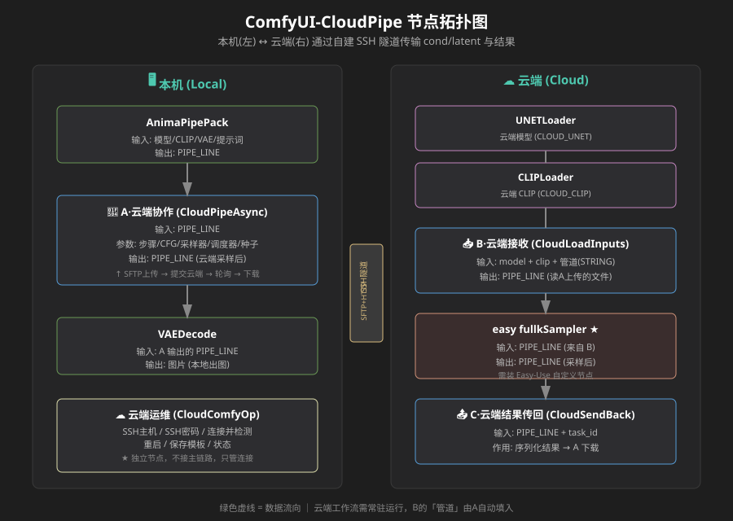
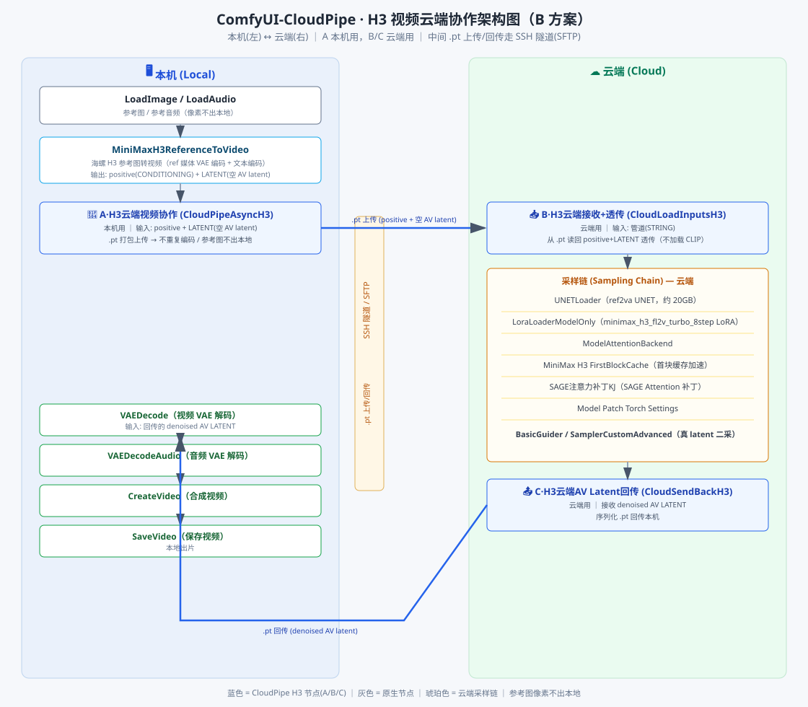

# ComfyUI-CloudPipe

> **把本机工作流的「采样」丢到云端显卡跑，本地只负责出图。**
> Offload ComfyUI sampling to a cloud GPU — your local machine just decodes and saves.

[](LICENSE)

---

## 中文说明

### 0. 30 秒看懂

**一句话**：在本机 ComfyUI 里点一下「运行」，采样任务自动送上云端 GPU，算完自动传回本机解码出图。

**适合谁 / 不适合谁**

| 适合 | 不适合 |
|---|---|
| 本机显存不够（12G 以下），但租了按需 GPU 实例 | 手头没有云实例 |
| 想保留本机界面操作、本地出图的习惯 | 小模型（本地几秒就出，传文件反而更慢） |
| Anima 图片 / H3 视频这类「采样重、解码轻」的模型 | 需要反复实时预览调参的流程 |

**它怎么工作**

```text
        本机 ComfyUI                          云端 GPU 实例
┌────────────────────────┐            ┌──────────────────────────┐
│  你的工作流             │            │  📥 B·云端接收            │
│         ↓              │ ①上传.pt   │         ↓                │
│  🔄 A·云端协作 ─────────┼───────────→│  采样（UNET / LoRA / …）  │
│         ↑              │            │         ↓                │
│  VAEDecode 解码 → 出图   │ ③下载.pt   │  📤 C·结果传回            │
└────────────────────────┘←───────────└──────────────────────────┘
                ② 整条链路只靠一条自建 SSH 隧道：
                   端口转发（HTTP/WS） + SFTP 传文件 + 远程执行命令
```

**为什么要自建隧道**：云平台控制台提供的隧道只能转发端口，传文件、远程执行还得另配。本插件用一条 paramiko 持久会话把三件事一起做了，所以不需要额外的第三方隧道工具。

---

### 1. 开跑前的准备清单

**本机（Local）**
- [ ] ComfyUI（能装自定义节点）
- [ ] 能执行 `pip install`（用启动器自带的 python 也行）
- [ ] 云实例的 SSH 信息：**主机地址、端口、用户名、密码**
- [ ] 跑图片链路才需要：`AnimaPipePack` 之类的管道打包节点（A 节点的输入是 `PIPE_LINE`）

**云端 GPU 实例（Cloud）**
- [ ] 能开机、能 SSH 的 GPU 实例（Seetacloud / AutoDL / 其他平台均可）
- [ ] 实例上已经装好 ComfyUI
- [ ] **实例上也装了本插件**（B / C 节点必须出现在云端）
- [ ] 云端 ComfyUI 监听 `127.0.0.1:6006`（默认端口）
- [ ] 模型文件已就位（图片链路见 §4，H3 见 §7）

> 云端 ComfyUI 还没装？见 [docs/SETUP_CN.md](docs/SETUP_CN.md)

---

### 2. 先选一条路线

| 路线 | 用途 | 额外前置 | 建议 |
|---|---|---|---|
| **① 链路自检**（建议先做） | 不加载模型，只验证「上传 → 云端 → 回传」通不通 | 两边都装本插件即可 | **装完先跑这条，2 分钟排掉 90% 的接线问题** |
| ② 图片采样上云 | Anima 等图像模型 | AnimaPipePack + Easy-Use 的 `easy fullkSampler` | 见 §4 |
| ③ H3 视频上云 | 参考图/音频 → 视频 | H3 模型全家桶（UNET + LoRA + VAE + 上采样器） | 见 §7 |

---

### 3. 三步跑通

#### 第 1 步 · 云端准备（一次性，约 10 分钟）

1. 在云平台开机实例，记下 **SSH 主机 / 端口 / 密码**。
2. 在云端安装 ComfyUI（若尚未安装），再装本插件：

   ```bash
   cd <云端ComfyUI>/custom_nodes
   git clone https://github.com/guluoshen/ComfyUI-CloudPipe.git
   pip install -r ComfyUI-CloudPipe/requirements.txt
   ```

3. 重启云端 ComfyUI。

✅ **成功标志**：云端节点菜单里能看到 `📥 B·云端接收`、`📤 C·结果传回`、`🔁 云端测试回传`。

#### 第 2 步 · 本机安装（约 2 分钟）

```bash
cd <你的ComfyUI>/custom_nodes
git clone https://github.com/guluoshen/ComfyUI-CloudPipe.git
pip install -r ComfyUI-CloudPipe/requirements.txt
```

重启 ComfyUI。

✅ **成功标志**：节点菜单出现「☁️ 云端运维」等节点；启动日志里出现 `已部署 ... 前端扩展`。

#### 第 3 步 · 连上云端并自检

1. 画布上添加一个「**☁️ 云端运维**」节点。
2. 「SSH主机」按这个格式填：

   ```text
   ssh -p 端口 用户名@主机地址
   ```

   例如（端口换成你自己实例的）：

   ```text
   ssh -p 12345 root@connect.cqa1.seetacloud.com
   ```

   > **端口必须写**。同一主机上多个实例共用主机名，只能靠端口区分。

3. 「SSH密码」填实例密码。密码只保存在本机加密文件 `config/cloud_comfy.json`，不会外传（该文件已被 `.gitignore` 排除）。
4. 点「**连接并检测**」。

✅ **成功标志**：节点变绿 + 状态栏显示 GPU/CPU 模式 + 数据往返测试通过。

5. 常用连接可以点「保存模板」，下次从下拉直接选。

> **想先验证链路**：把「🔁 云端测试回传」放进云端工作流，本机跑一次，确认数据往返无损。它不加载模型，纯 CPU 实例也能测。

---

### 4. 图片链路：本机与云端怎么接

**本机**（编辑提示词、调参数、解码出图）

```text
[AnimaPipePack] → [🔄 A·云端协作] → [VAEDecode] → [SaveImage]
                        ↑ 步骤 / CFG / 采样器 / 种子 在本节点上调
```

**云端**（搭一次，长期常驻）

```text
[📥 B·云端接收] → [easy fullkSampler] → [📤 C·结果传回]
       ↑ model / clip 接云端加载器
```

B 节点的「管道」是 STRING（任务号），由 A 自动传入，不需要手动填。
两端「管道」值必须相同才能配对。

---

### 5. 常见问题（FAQ）

| 现象 | 原因 | 处理 |
|---|---|---|
| 连接变红「SSH 不通」 | 实例关机 / 密码错 / 主机栏没带端口 | 去云平台控制台开机；主机栏写全 `ssh -p 端口 用户@主机` |
| 状态显示「CPU 模式」 | 实例没切到 GPU | 在平台控制台切 GPU 后再点一次「连接并检测」 |
| 云端报「节点不存在」 | 云端没装本插件 | 云端也 `git clone` + `pip install` + 重启 |
| 云端报「模型找不到」 | 模型路径不匹配 | 改 `core/cloud_pipe_sender.py` 顶部的 `CLOUD_UNET / CLOUD_CLIP / CLOUD_LORA` |
| 卡在「上传」很久 | 文件较大 + 带宽小 | cond/latent 走 SFTP，看体积大小；换带宽更大的实例 |
| 实例关机后连不上 | SSH 隧道已断开 | 重新点「连接并检测」（会自动重连，必要时尝试开机） |
| 改了 JS，界面没变化 | 浏览器缓存了扩展模块 | 关闭标签页重开，或 `Ctrl+F5` 强刷 |
| 出了图/视频找不到 | 输出在本机 | 位置由本机 `SaveImage` / `SaveVideo` 决定 |

---

### 6. 节点一览

| 节点 | 运行位置 | 作用 |
|------|------|------|
| **☁️ 云端运维** (CloudComfyOp) | 本机 | 填 SSH 连接、连接并检测、重启云端、保存/删除连接模板、显示状态 |
| **🔄 A·云端协作** (CloudPipeAsync) | 本机 | 接收本地管道 → SFTP 上传 cond/latent → 提交云端工作流 → 轮询 → 下载结果 → 输出新管道 |
| **📥 B·云端接收** (CloudLoadInputs) | 云端 | 读 A 上传的文件 + 云端 model/clip → 组装管道 |
| **📤 C·结果传回** (CloudSendBack) | 云端 | 把采样后的管道序列化回传本机 |
| **🔁 云端测试回传** (CloudTestEcho) | 云端 | 测试数据往返是否无损（不加载模型，无 GPU 也能跑） |

**节点拓扑图**：



**核心机制**：一条自建 SSH 隧道（paramiko 持久会话）同时承担 ①本地端口转发（HTTP/WS 到云端 ComfyUI）、②SFTP 上传下载、③远端 exec（探测/重启）。不依赖云平台控制台的隧道。

**依赖**（见 `requirements.txt`）：

- `paramiko` —— SSH 隧道
- `requests` —— 云端 HTTP 交互
- `websocket-client` —— 云端采样进度监听（可选；缺失只跳过进度打印）
- `torch` / `safetensors` —— 随 ComfyUI 自带

---

### 7. H3 视频云端协作（进阶）

**一句话原理**：在原生「MiniMax H3 参考图转视频」（`MiniMaxH3ReferenceToVideo`）之后，插入三个云端协作节点，把本机已编码好的条件 `positive`(CONDITIONING，条件张量) 与空 AV `LATENT`(潜空间张量) 打包成 `.pt` 上传云端采样，结果回传本机解码出视频 —— **参考图像素不出本地、本机不重复编码**。

**架构图**：



**三个节点**：

| 节点 class 名 | 显示名 | 位置 | 作用 |
|------|------|------|------|
| `CloudPipeAsyncH3` | 🔄 A·H3云端视频协作 | 本机 | 接在原生 `MiniMaxH3ReferenceToVideo` 之后，接收 `positive`(CONDITIONING，条件) + `LATENT`(空 AV latent，潜空间张量)，打包 `.pt` 上传云端；不重复编码、参考图像素不出本地 |
| `CloudLoadInputsH3` | 📥 B·H3云端接收+透传 | 云端 | 只接「管道」`(STRING，字符串)` 一个输入，从 `.pt` 读回 `positive` + `LATENT` 透传给采样链；云端因此无需加载约 27GB 的 CLIP（文本编码器） |
| `CloudSendBackH3` | 📤 C·H3云端AV Latent回传 | 云端 | 接收采样后的 `denoised`(去噪) AV `LATENT`，序列化回传本机 |

**本机接线**：

```text
[LoadImage] ─┐
[LoadAudio] ─┼─→ [MiniMaxH3ReferenceToVideo]（ref 媒体 VAE 编码 + 文本编码）
             │        ↓ positive(CONDITIONING) + LATENT(空 AV latent)
             └─→ [🔄 A·H3云端视频协作] →(.pt 上传)→ 云端
```

**本机收尾**（回传后）：

```text
[.pt 回传] → [VAEDecode]（视频 VAE 解码）→ [VAEDecodeAudio]（音频 VAE 解码）→ [CreateVideo] → [SaveVideo]
```

**云端常驻链**：

```text
[📥 B·H3云端接收+透传]（管道 STRING）
   → [UNETLoader]（ref2va UNET，约 20GB）
   → [LoraLoaderModelOnly]（minimax_h3_fl2v_turbo_8step LoRA）
   → [ModelAttentionBackend]
   → [MiniMax H3 FirstBlockCache]（首块缓存加速）
   → [SAGE注意力补丁KJ]（SAGE Attention 补丁）
   → [Model Patch Torch Settings]
   → [BasicGuider] / [SamplerCustomAdvanced]（真 latent 二采）
   → [📤 C·H3云端AV Latent回传] →(.pt 回传)→ 本机
```

**云端前置依赖清单**：

- ref2va UNET（约 20GB）
- `minimax_h3_fl2v_turbo_8step` LoRA（turbo 8 步加速）
- `MinimaxH3LatentUpscalerNode3D` 节点 + 约 691MB bf16（bfloat16，16 位浮点）模型（latent 上采样器）
- H3 视频 / 音频 VAE（变分自编码器，编解码潜空间）
- 注：CLIP（qwen3vl，文本编码器）本机端需要，云端 B 端不需要（由 A 节点随 `positive` 一并上传）

**与图片（Anima）方案的区别**：

- H3 三件套是**独立新增**，不修改 Anima 的 A/B/C 节点（`CloudPipeAsync` / `CloudLoadInputs` / `CloudSendBack`）。
- Anima 走 `easy fullkSampler`（Easy-Use 采样器）一步采样；H3 走原生 `MiniMaxH3ReferenceToVideo` + 自定义采样链（`BasicGuider` / `SamplerCustomAdvanced` 真 latent 二采），且 B 端跳过 CLIP 加载（省约 27GB 显存/内存）。
- 数据载体：Anima 上传 cond/latent（`.pt`）；H3 上传已编码的 `positive` + `LATENT`（空 AV latent，`.pt`），回传 `denoised` AV `LATENT`。

**演示工作流**（`examples/` 目录）：

| 文件 | 用途 | 节点数 | 运行位置 |
|------|------|--------|----------|
| `examples/h3_local_workflow.json` | **本机半场**：参考图/音频编码 → A 节点上传 → 云端回传后 `VAEDecode`(视频 VAE 解码) + `VAEDecodeAudio`(音频 VAE 解码) → `CreateVideo` → `SaveVideo`（可选：`MiniMaxVideoDirector` 一句话生成提示词） | 18 | 本机（含 `CloudPipeAsyncH3`） |
| `examples/h3_cloud_workflow.json` | **云端半场**：`CloudLoadInputsH3`(B) 透传 → UNET/LoRA/采样链（含 `MinimaxH3LatentUpscalerNode3D` 真 latent 二采）→ `CloudSendBackH3`(C) 回传 | 19 | 云端实例（无 CLIP 依赖） |

**用法**：先把 `h3_cloud_workflow.json` 在云端 ComfyUI 打开，设好 B 节点的「管道」值（与本地 A 节点约定一致，默认 `default`）；再把 `h3_local_workflow.json` 在本机打开，选好参考图/音频即可。**两端「管道」值必须相同才能配对。**

> 本地半场已按 ComfyUI 官方模板 `video_minimax_h3_r2v` 对齐精简到 **18 节点**（相比初版删掉了 4 个说明 Note、2 个调试 `ShowText`、翻译支线 `PromptTranslate`、`Reroute` 与重复的 `PrimitiveFloat`；所有节点均为启用状态）。
> 提示词两条路：接 `MiniMaxVideoDirector`（一句话由本地 LLM 生成，会覆盖手写值），或断开那条连线直接在「提示词」节点手写。
> 想再少两个节点，删掉 `MiniMaxVideoDirector` + `MiniMaxReferenceItem` 即为纯手写版（16 节点）。

---

### 8. 安全与隐私

- SSH 密码只存本机加密文件 `config/cloud_comfy.json`，该文件已被 `.gitignore` 排除，**不会进入仓库**。
- 仓库中的代码与文档**不含任何真实密码、实例端口或个人信息**（示例端口为占位值 `12345`）。
- 插件只连接你自己填写的 SSH 主机，不向任何第三方上报数据。

---

### 9. 已知限制（Known limitations）

- 只支持 SSH **密码**登录，暂不支持密钥登录。
- 云端采样器固定使用 `easy fullkSampler`（Easy-Use）；换其他采样器需要自行修改 A 节点拼的 `cloud_wf`。
- 数据往返走 SFTP，cond/latent 可能较大，速度取决于网络。
- 已测试组合：Windows 本机 + Linux 云端；其他组合未验证。

---

## English

### 0. What is this

A ComfyUI custom-node pack that lets you **edit prompts and models locally, push the sampling job to a cloud GPU instance with one click, and get the result back automatically**.

Built for the common case: your local GPU is modest (a GTX 1060 6 GB class card is enough to run the ComfyUI UI and decode locally), but you rent a pay-as-you-go cloud GPU with more VRAM.

**Good fit / poor fit**

| Good fit | Poor fit |
|---|---|
| Local VRAM is the bottleneck, cloud GPU is rented by the hour | No cloud instance available |
| You want to keep the local UI + local decode workflow | Small models that finish locally in seconds |
| Heavy-sampling models (Anima images, H3 video) | Workflows needing constant real-time preview |

**How it works**

```text
      Local ComfyUI                        Cloud GPU instance
┌──────────────────────┐            ┌──────────────────────────┐
│  Your workflow       │            │  📥 B·Cloud Load          │
│         ↓            │ ①upload.pt │         ↓                │
│  🔄 A·Cloud Pipe ────┼───────────→│  Sampling (UNET/LoRA/…)   │
│         ↑            │            │         ↓                │
│  VAEDecode → output  │ ③fetch.pt  │  📤 C·Send Back           │
└──────────────────────┘←───────────└──────────────────────────┘
        ② A single self-managed SSH tunnel carries everything:
           port forwarding (HTTP/WS) + SFTP + remote exec
```

Why a self-managed tunnel: platform "console tunnels" only forward ports; you still need separate plumbing for file transfer and remote commands. One persistent paramiko session handles all three.

### 1. Prerequisites

**Local**
- [ ] ComfyUI (able to load custom nodes)
- [ ] `pip install` available (a portable-launcher python is fine)
- [ ] SSH access to the cloud: **host, port, user, password**
- [ ] For the image route only: a pipe-packing node such as AnimaPipePack (node A expects `PIPE_LINE`)

**Cloud GPU instance**
- [ ] A GPU instance you can start and SSH into (Seetacloud / AutoDL / others)
- [ ] ComfyUI installed on it
- [ ] **This node pack installed there too** (B / C must exist in the cloud)
- [ ] Cloud ComfyUI listening on `127.0.0.1:6006`
- [ ] Models in place (images: §4; H3: §7)

### 2. Pick a route first

| Route | Purpose | Extra prerequisites |
|---|---|---|
| **① Link self-test** (do this first) | Verify upload → cloud → fetch with no model loading | Both sides have this pack |
| ② Image sampling | Anima and similar | AnimaPipePack + Easy-Use `easy fullkSampler` |
| ③ H3 video | Reference image/audio → video | Full H3 model set (see §7) |

### 3. Get it running in three steps

**Step 1 — Cloud (once, ~10 min)**

```bash
cd <cloud-comfyui>/custom_nodes
git clone https://github.com/guluoshen/ComfyUI-CloudPipe.git
pip install -r ComfyUI-CloudPipe/requirements.txt
```

Restart cloud ComfyUI. ✅ **Success**: `📥 B·Cloud Load`, `📤 C·Send Back`, `🔁 Cloud Test Echo` appear in the cloud node menu.

**Step 2 — Local (~2 min)**

```bash
cd <your-comfyui>/custom_nodes
git clone https://github.com/guluoshen/ComfyUI-CloudPipe.git
pip install -r ComfyUI-CloudPipe/requirements.txt
```

Restart ComfyUI. ✅ **Success**: the `☁️ Cloud Ops` node appears; the startup log shows `已部署 ... 前端扩展`.

**Step 3 — Connect and verify**

1. Add a **☁️ Cloud Ops** node.
2. Fill `SSH主机` as `ssh -p PORT USER@HOST`, e.g. `ssh -p 12345 root@connect.cqa1.seetacloud.com` (use your own port).
   The port is required — multiple instances on one host share the hostname.
3. Fill `SSH密码`. It is stored only in the local encrypted file `config/cloud_comfy.json` (git-ignored).
4. Click **连接并检测**.

✅ **Success**: node turns green, status shows GPU/CPU mode, round-trip test passes.

### 4. Image route wiring

Local: `[AnimaPipePack] → [🔄 A·Cloud Pipe] → [VAEDecode] → [SaveImage]` (steps/CFG/sampler/seed are set on node A).

Cloud (build once, keep running): `[📥 B·Cloud Load] → [easy fullkSampler] → [📤 C·Send Back]` (model/clip from cloud loaders).

B's `管道` input is a STRING task id fed automatically by A. Both sides must use the same `管道` value to pair up.

### 5. FAQ

| Symptom | Cause | Fix |
|---|---|---|
| Red "SSH unreachable" | Instance off / wrong password / port missing | Start the instance in the platform console; write the full `ssh -p PORT USER@HOST` |
| Status shows "CPU mode" | Instance not switched to GPU | Switch to GPU in the platform console, then reconnect |
| "Node not found" in cloud | Pack not installed on the cloud | `git clone` + install on the cloud too, restart |
| "Model not found" in cloud | Path mismatch | Edit `CLOUD_UNET / CLOUD_CLIP / CLOUD_LORA` in `core/cloud_pipe_sender.py` |
| Stuck uploading | Large .pt + low bandwidth | Transfer is SFTP-based; check size, use a faster instance |
| Can't connect after shutdown | Tunnel dropped | Click 连接并检测 again (auto-reconnects / tries to start the instance) |
| JS edits not visible | Browser cached extension modules | Reopen the tab or `Ctrl+F5` |
| Where is the output? | On the local machine | Determined by your local `SaveImage` / `SaveVideo` |

### 6. Nodes

| Node | Where | Role |
|------|-------|------|
| **☁️ Cloud Ops** (CloudComfyOp) | Local | SSH connection, connect & probe, restart cloud, save/delete profiles, show status |
| **🔄 A·Cloud Pipe** (CloudPipeAsync) | Local | Take local pipe → SFTP upload cond/latent → submit cloud workflow → poll → download → output new pipe |
| **📥 B·Cloud Load** (CloudLoadInputs) | Cloud | Read A's uploaded files + cloud model/clip → assemble pipe |
| **📤 C·Send Back** (CloudSendBack) | Cloud | Serialize the sampled pipe back to local |
| **🔁 Cloud Test Echo** (CloudTestEcho) | Cloud | Round-trip integrity test (no model load, runs on CPU-only) |

### 7. H3 video cloud collaboration (advanced)

Wiring, cloud prerequisites and the two example workflows are documented in the Chinese section above (§7). In short:

- Local: `[LoadImage]/[LoadAudio] → [MiniMaxH3ReferenceToVideo] → [🔄 A·H3]  → (.pt upload) → cloud`
- Local tail: `(.pt back) → [VAEDecode] + [VAEDecodeAudio] → [CreateVideo] → [SaveVideo]`
- Cloud: `[📥 B·H3] → UNET + LoRA + sampling chain → [📤 C·H3] → (.pt back) → local`
- Reference image pixels never leave the local machine; the cloud skips the ~27GB CLIP encoder.

### 8. Security & privacy

- SSH passwords live only in the local encrypted file `config/cloud_comfy.json`, which is git-ignored.
- No real passwords, instance ports or personal data are present in the repository (sample ports are placeholders such as `12345`).
- The pack only connects to the SSH host you configure; no data is reported anywhere else.

### 9. Known limitations

- SSH password auth only (no key auth yet).
- The cloud sampler is fixed to `easy fullkSampler` (Easy-Use); other samplers require editing node A's `cloud_wf`.
- Data round-trip uses SFTP; cond/latent payloads can be large and depend on network speed.
- Tested on Windows local + Linux cloud; other combinations are unverified.

---

## License

MIT — see [LICENSE](LICENSE).
